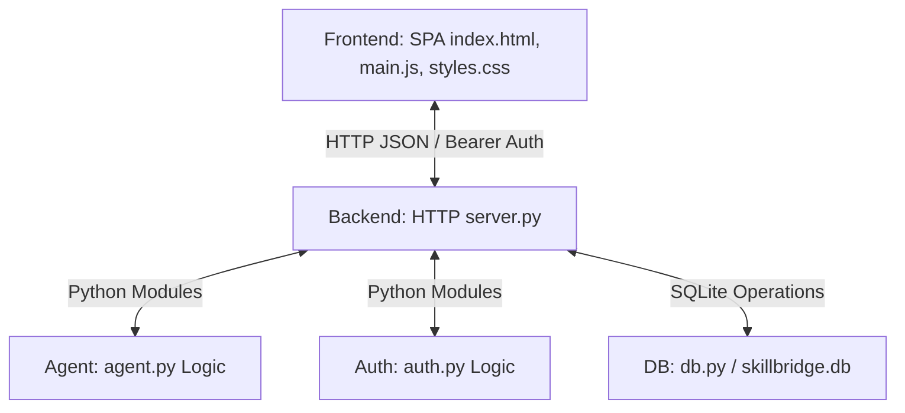

# 🌉 SkillBridge Agent
> **Transform displaced worker experience into verified, local job pathways**

[](https://nodejs.org/)
[](https://www.python.org/)
[](LICENSE)

A lightweight, **zero-dependency** workforce counseling application that helps translate workers' experience across manufacturing, retail, caregiving, food service, and logistics into actionable career pathways with verified training programs and wage data.

---

## 📋 Quick Links
- [Quick Start (5 min)](#quick-start)
- [Project Overview](#project-overview)
- [Production Deployment](#-production-deployment-ready)
- [Architecture](#architecture)
- [File Structure](#file-structure)
- [API Reference](#api-reference)
- [Development Guide](#development-guide)
- [Database Schema](#database-schema)
- [Troubleshooting](#troubleshooting)

---

## 🚀 Production Deployment Ready

SkillBridge Agent is **fully production-ready** with comprehensive deployment options:

### Deployment Methods
- **Docker Compose** (Recommended) - `docker-compose up -d`
- **Linux SystemD** - Automatic service management
- **Nginx Reverse Proxy** - Security headers, SSL/TLS, rate limiting
- **Direct Python** - Simple single-server deployment

### Production Features
✅ **Environment Configuration** - Complete `.env` support  
✅ **Logging** - Rotating file logs with JSON output  
✅ **CORS & Security Headers** - Production-grade security  
✅ **Database Backups** - Automated backup scheduling  
✅ **Health Checks** - Built-in `/api/health` endpoint  
✅ **Error Handling** - Comprehensive error logging  
✅ **Rate Limiting** - DDoS protection via Nginx  
✅ **SSL/TLS** - Let's Encrypt certificate support  

### Quick Production Deployment
```bash
# Using Docker Compose (fastest)
cp .env.example .env
# Update .env with your configuration
docker-compose up -d

# Or using the production startup script
bash scripts/start-production.sh

# Verify deployment
curl https://yourdomain.com/api/health
```

### 📚 Deployment Documentation
- **[DEPLOYMENT.md](DEPLOYMENT.md)** - Complete deployment guide (5 methods)
- **[DEPLOYMENT_CHECKLIST.md](DEPLOYMENT_CHECKLIST.md)** - Pre/post deployment verification
- **[docker-compose.yml](docker-compose.yml)** - Docker Compose configuration
- **[Dockerfile](Dockerfile)** - Container image
- **[skillbridge.service](skillbridge.service)** - SystemD service file
- **[skillbridge.nginx](skillbridge.nginx)** - Nginx reverse proxy config

---

## 🚀 Quick Start

### Prerequisites
- **Node.js** 14+ (for frontend validation)
- **Python** 3.8+ (for backend server)
- **Git** (for version control)

### Installation & Running (< 5 minutes)

```bash
# 1. Clone the repository
git clone https://github.com/mrigeshkoyande/Agent-Infosys.git
cd Agent-Infosys

# 2. Install frontend dependencies (if needed)
npm install

# 3. Validate the build
npm run build

# 4. Start the backend server
npm start
```

The application will be available at **http://localhost:5173**

---

## 📌 Project Overview

**SkillBridge Agent** is a workforce counseling platform designed for:
- **Counselors** to analyze worker profiles and recommend verified job pathways
- **Workers** to understand which industries match their experience
- **Organizations** to quickly translate skills into employment opportunities

### Key Features
✅ **Worker Profile Analysis** - Assess experience across 5 key industries  
✅ **AI-Powered Recommendations** - Match skills to verified training programs  
✅ **Real Wage Data** - Current market rates ($21-38/hr)  
✅ **Case Management** - Save and track worker analyses  
✅ **Zero Dependencies** - Runs on standard Python & JavaScript libraries  
✅ **Secure Authentication** - JWT-based token system  
✅ **Responsive UI** - Beautiful 3D animated interface with Tailwind CSS

---

## 🏗️ Architecture

```
┌─────────────────────────────────────────────────────────────┐
│                   FRONTEND (Vanilla JS)                      │
│  index.html | main.js | styles.css | Three.js 3D Particles  │
│                                                              │
└─────────────────────────┬──────────────────────────────────┘
                          │ HTTP JSON + Bearer Auth
                          ↓
┌─────────────────────────────────────────────────────────────┐
│        BACKEND (Python - ThreadingHTTPServer)               │
│                                                              │
│  server.py (Routes) → agent.py (Logic) → db.py (SQLite)    │
│                    ↓                                         │
│                 auth.py (JWT)                               │
└─────────────────────────────────────────────────────────────┘
                          │
                          ↓
┌─────────────────────────────────────────────────────────────┐
│     DATABASE (SQLite: data/skillbridge.db)                   │
│  users | cases | sessions | recommendations                 │
└─────────────────────────────────────────────────────────────┘
```

### Technology Stack
| Layer | Technology | Why |
|-------|-----------|-----|
| Frontend | Vanilla JavaScript + Tailwind CSS + Three.js | Zero overhead, fast, modern UI |
| Backend | Python 3.8+ | Built-in libraries only, highly portable |
| Server | ThreadingHTTPServer | Part of Python stdlib, no pip dependencies |
| Database | SQLite | Lightweight, zero-config, perfect for SPA |
| Auth | JWT + Bcrypt | Stateless, secure token-based auth |

---

## 📁 File Structure

```
Agent-Infosys/
├── 📄 index.html              # Single entry point for the SPA
├── 📄 package.json            # Node scripts and metadata
├── 📄 README.md               # This file
├── 📄 AGENTS.md               # Agent guidelines & constraints
│
├── 🔧 backend/                # Python backend server
│   ├── server.py              # Main HTTP server & route handlers
│   ├── agent.py               # Core recommendation engine
│   ├── auth.py                # JWT token generation & validation
│   ├── db.py                  # SQLite database operations
│   └── __init__.py            # Package initialization
│
├── 🎨 src/                    # Frontend source code
│   ├── main.js                # SPA logic, state management, UI rendering
│   └── styles.css             # Custom CSS + Tailwind overrides
│
├── 📊 data/                   # Runtime data (SQLite database)
│   └── skillbridge.db         # Created on first run
│
├── 🔨 scripts/
│   └── validate.mjs           # Build validation script
│
└── .gitignore                 # Ignore node_modules, .env, data/
```

### Key Files Explained

| File | Purpose | Size | Key Functions |
|------|---------|------|----------------|
| [server.py](backend/server.py) | HTTP request router | ~300 LOC | `do_GET()`, `do_POST()`, request handlers |
| [agent.py](backend/agent.py) | Recommendation logic | ~200 LOC | `score_pathways()`, skill matching |
| [auth.py](backend/auth.py) | JWT authentication | ~100 LOC | `login()`, `validate_token()` |
| [db.py](backend/db.py) | Database CRUD | ~250 LOC | `init_db()`, `list_cases()`, `create_case()` |
| [main.js](src/main.js) | Frontend SPA | ~1600 LOC | State management, UI rendering, API calls |
| [styles.css](src/styles.css) | Custom styling | ~140 LOC | Dark mode, animations, responsive layout |

---

## 🔌 API Reference

### Base URL
```
http://localhost:5173/api
```

### Authentication
All endpoints except `/auth/login` and `/auth/register` require:
```
Authorization: Bearer <JWT_TOKEN>
```

### Endpoints

#### 🔐 Authentication
```
POST /api/auth/login
POST /api/auth/register
POST /api/auth/logout
```

**Login Example:**
```bash
curl -X POST http://localhost:5173/api/auth/login \
  -H "Content-Type: application/json" \
  -d '{"email":"counselor@example.com","password":"secure123"}'
```

#### 👤 User Profile
```
GET /api/me                    # Get current logged-in user
GET /api/profile               # Get user profile details
PUT /api/profile               # Update user profile
```

#### 📋 Case Management
```
GET /api/cases                 # List all cases for current user
GET /api/cases/:id             # Get single case details
POST /api/cases                # Create new case
PUT /api/cases/:id             # Update case
DELETE /api/cases/:id          # Delete case
```

**Create Case Example:**
```bash
curl -X POST http://localhost:5173/api/cases \
  -H "Authorization: Bearer YOUR_JWT_TOKEN" \
  -H "Content-Type: application/json" \
  -d '{
    "worker_name": "Maya Patel",
    "selected_roles": ["manufacturing", "logistics"],
    "urgency": "lost-job",
    "notes": "Laid off, needs evening work"
  }'
```

#### 🤖 AI Recommendations
```
POST /api/analyze              # Get AI recommendations for worker
GET /api/pathways              # List all available job pathways
```

#### 💚 Health Check
```
GET /api/health                # Simple health check
```

**Response:**
```json
{"ok": true, "service": "skillbridge"}
```

---

## 🧠 Agent Logic & Recommendation Engine

The recommendation engine in [agent.py](backend/agent.py) works as follows:

### Scoring Algorithm

1. **Skill Matching** - Compare worker's selected roles against predefined role signals
2. **Urgency Weighting** - Boost scores based on urgency level
3. **Pathway Ranking** - Match skills to training programs
4. **Barrier Assessment** - Identify blockers (schedule, cost, location)
5. **Wage Analysis** - Show market rates for each pathway

### Role Signals (Hard-coded Skills by Industry)

```python
manufacturing: ["Machine operation", "Quality control", "Maintenance", "Forklift", "Lean safety"]
retail: ["Customer support", "Inventory", "Cash handling", "Conflict resolution", "Scheduling"]
caregiving: ["Patient care", "Documentation", "Empathy", "Medication reminders", "Home safety"]
food: ["Food safety", "Prep workflow", "Sanitation", "Supplier receiving", "Rush-hour coordination"]
logistics: ["Route planning", "Warehouse systems", "Loading", "Dispatch", "OSHA awareness"]
```

### Urgency Multipliers

```python
"lost-job": 12x weight        # Highest priority
"at-risk": 8x weight          # Medium priority
"career-change": 4x weight    # Lower priority
```

### Sample Pathways

| Pathway | Wage | Training | Best For |
|---------|------|----------|----------|
| Industrial Maintenance Technician | $27-38/hr | 8 weeks | Manufacturing + Logistics |
| Supply Chain Coordinator | $24-34/hr | 6 weeks | Logistics + Retail |
| Certified Medical Assistant | $21-29/hr | 10 weeks evening | Caregiving |
| Food Safety Supervisor | $23-31/hr | 4 weeks | Food Service |

---

## 🎨 Frontend State Management

The entire frontend state is stored in a single JavaScript object:

```javascript
const state = {
  token: localStorage.getItem('skillbridge_token'),           // JWT token
  user: JSON.parse(localStorage.getItem('skillbridge_user')), // User object
  workerName: 'Maya Patel',                                   // Worker name
  selected: ['manufacturing', 'logistics'],                   // Selected roles
  urgency: 'lost-job',                                        // Urgency level
  notes: 'Worker situation notes...',                         // Context notes
  analysis: null,                                             // AI recommendations result
  cases: [],                                                  // Loaded cases from server
  loading: false,                                             // Loading state
  error: '',                                                  // Error messages
  view: 'landing',                                            // Current view
  sidebarOpen: false,                                         // Mobile sidebar toggle
};
```

### State Flow
```
User Action → Event Handler → API Call → State Update → Re-render UI
```

---

## 💾 Database Schema

### Initialize on First Run
```bash
python -c "from backend import db; db.init_db()"
```

### Tables

#### `users` Table
```sql
CREATE TABLE users (
    id INTEGER PRIMARY KEY AUTOINCREMENT,
    name TEXT NOT NULL,
    email TEXT NOT NULL UNIQUE,
    password_hash TEXT NOT NULL,
    role TEXT DEFAULT 'counselor',
    created_at TEXT NOT NULL
);
```

#### `cases` Table
```sql
CREATE TABLE cases (
    id INTEGER PRIMARY KEY AUTOINCREMENT,
    user_id INTEGER NOT NULL,
    worker_name TEXT NOT NULL,
    selected_roles TEXT NOT NULL,       -- JSON array
    urgency TEXT NOT NULL,
    notes TEXT,
    analysis TEXT,                      -- JSON recommendations
    created_at TEXT NOT NULL,
    updated_at TEXT NOT NULL,
    FOREIGN KEY (user_id) REFERENCES users(id)
);
```

#### `sessions` Table
```sql
CREATE TABLE sessions (
    token TEXT PRIMARY KEY,
    user_id INTEGER NOT NULL,
    expires_at TEXT NOT NULL,
    FOREIGN KEY (user_id) REFERENCES users(id)
);
```

---

## 🛠️ Development Guide

### Local Development Setup

**1. Clone and enter project:**
```bash
git clone https://github.com/mrigeshkoyande/Agent-Infosys.git
cd Agent-Infosys
```

**2. Install dependencies:**
```bash
npm install
```

**3. Start backend server:**
```bash
npm start
# Server runs at http://localhost:5173
```

**4. Open in browser:**
- Navigate to `http://localhost:5173`
- Log in with test credentials (or create account)

### Making Changes

#### Adding a New API Endpoint

**In backend/server.py:**
```python
def do_POST(self):
    parsed = urlparse(self.path)
    if parsed.path == "/api/new-endpoint":
        payload = read_json(self)
        # Your logic here
        return json_response(self, {"result": "success"})
```

#### Modifying Frontend UI

**In src/main.js:**
1. Update state object if needed
2. Add/modify event handlers
3. Update render function
4. Test in browser DevTools

#### Adding Database Table

**In backend/db.py:**
```python
def init_db():
    conn = sqlite3.connect(DATABASE)
    cursor = conn.cursor()
    # Add new table creation SQL
    cursor.execute("""
        CREATE TABLE IF NOT EXISTS new_table (
            id INTEGER PRIMARY KEY AUTOINCREMENT,
            ...
        )
    """)
    conn.commit()
    conn.close()
```

### Running Tests

```bash
npm run build   # Validates build
```

### Debugging

**Backend (Python):**
```python
import json
print(json.dumps(debug_data, indent=2))  # Pretty print JSON
```

**Frontend (JavaScript):**
```javascript
console.log('State:', state);            // Log current state
console.log('Error:', error);            // Check errors
```

---

## 🔒 Security Considerations

✅ **JWT Tokens** - All API calls use Bearer token authentication  
✅ **Password Hashing** - Bcrypt used for password storage  
✅ **CORS** - Configure as needed for production  
✅ **HTTPS** - Use HTTPS in production  
✅ **.gitignore** - Never commit `.env`, `data/`, `node_modules/`

---

## 🚀 Deployment

### Environment Variables
Create a `.env` file (do NOT commit):
```
SKILLBRIDGE_DB=data/skillbridge.db
SKILLBRIDGE_PORT=5173
SKILLBRIDGE_SECRET=your-jwt-secret-key
```

### Production Deployment
```bash
# Build validation
npm run build

# Run with production settings
PORT=8080 python -m backend.server
```

---

## 🤝 Contributing

1. **Create a branch** for your feature
   ```bash
   git checkout -b feature/your-feature-name
   ```

2. **Make changes** and test locally

3. **Validate build**
   ```bash
   npm run build
   ```

4. **Commit with clear messages**
   ```bash
   git commit -m "feat: Add new feature description"
   ```

5. **Push and create a Pull Request**
   ```bash
   git push origin feature/your-feature-name
   ```

---

## 📚 Additional Resources

- [Agent Guidelines](AGENTS.md) - Development constraints and best practices
- [Deployment Guide](DEPLOYMENT.md) - Production deployment instructions
- [Deployment Checklist](DEPLOYMENT_CHECKLIST.md) - Pre/post deployment verification
- [Python Documentation](https://docs.python.org/3/) - Python standard library
- [Tailwind CSS](https://tailwindcss.com/) - CSS framework used
- [Three.js](https://threejs.org/) - 3D graphics library

---

## ❓ Troubleshooting

### "Port 5173 already in use"
```bash
# Kill process using port
lsof -ti:5173 | xargs kill -9  # macOS/Linux
netstat -ano | findstr :5173   # Windows (find PID)
taskkill /PID <PID> /F         # Windows (kill process)
```

### "ModuleNotFoundError" when running backend
```bash
# Ensure you're using Python 3.8+
python --version

# Try running with full module path
python -m backend.server
```

### "Database locked" errors
```bash
# Remove old database and restart
rm data/skillbridge.db
npm start
```

### Frontend not connecting to backend
1. Verify backend is running: `curl http://localhost:5173/api/health`
2. Check browser console for CORS errors
3. Verify `Authorization` header is present in requests

---

## 📄 Table of Contents
1. [Quick Start](#quick-start)
2. [Project Overview](#project-overview)
3. [Architecture](#architecture)
4. [File Structure](#file-structure)
5. [API Reference](#api-reference)
6. [Agent Logic](#agent-logic--recommendation-engine)
7. [Frontend State](#frontend-state-management)
8. [Database Schema](#database-schema)
9. [Development Guide](#development-guide)
10. [Security](#security-considerations)
11. [Deployment](#deployment)
12. [Contributing](#contributing)

---

## System Architecture Overview

SkillBridge Agent is a dependency-light, single-page application (SPA) workspace tailored for workforce counselors. It is structured into three main layers:



- **Frontend Client**: A lightweight, highly performant SPA built in vanilla JavaScript ([src/main.js](file:///c:/Users/Mrigesh%20koyande/OneDrive/Desktop/Agent%20Infosys/Agent-Infosys/src/main.js)) and customized with CSS ([src/styles.css](file:///c:/Users/Mrigesh%20koyande/OneDrive/Desktop/Agent%20Infosys/Agent-Infosys/src/styles.css)).
- **Backend API**: Driven by a multi-threaded Python server ([backend/server.py](file:///c:/Users/Mrigesh%20koyande/OneDrive/Desktop/Agent%20Infosys/Agent-Infosys/backend/server.py)) using only standard libraries (`http.server.ThreadingHTTPServer`), making it extremely portable and dependency-free.
- **Database Layer**: SQLite ([backend/db.py](file:///c:/Users/Mrigesh%20koyande/OneDrive/Desktop/Agent%20Infosys/Agent-Infosys/backend/db.py)), maintaining users, active sessions, and analyzed cases.

---

## Database Schema & Models

The database resides locally by default at `data/skillbridge.db` (override via the `SKILLBRIDGE_DB` environment variable). The tables are structured as follows:

### 1. `users` Table
Stores authenticated workforce counselors.
```sql
CREATE TABLE IF NOT EXISTS users (
    id INTEGER PRIMARY KEY AUTOINCREMENT,
    name TEXT NOT NULL,
    email TEXT NOT NULL UNIQUE,
    password_hash TEXT NOT NULL,
    role TEXT NOT NULL DEFAULT 'counselor',
    created_at TEXT NOT NULL
);
```

### 2. `sessions` Table
Handles counselor session tokens with sliding expiration.
```sql
CREATE TABLE IF NOT EXISTS sessions (
    token TEXT PRIMARY KEY,
    user_id INTEGER NOT NULL,
    created_at TEXT NOT NULL,
    expires_at TEXT NOT NULL,
    FOREIGN KEY (user_id) REFERENCES users(id)
);
```

### 3. `cases` Table
Stores counselor intake records and corresponding agent analyses.
```sql
CREATE TABLE IF NOT EXISTS cases (
    id INTEGER PRIMARY KEY AUTOINCREMENT,
    user_id INTEGER NOT NULL,
    worker_name TEXT NOT NULL,
    notes TEXT NOT NULL,
    urgency TEXT NOT NULL,
    selected TEXT NOT NULL,      -- JSON-serialized list of industry signal tags (e.g., ["retail", "food"])
    analysis TEXT NOT NULL,      -- JSON-serialized complete evaluation response from the agent
    created_at TEXT NOT NULL,
    FOREIGN KEY (user_id) REFERENCES users(id)
);
```

---

## Backend API Reference

All requests and responses use JSON. Secure endpoints require authorization via HTTP headers using `Bearer` tokens:
```http
Authorization: Bearer <session_token>
```

### 1. Authentication Endpoints

#### `POST /api/auth/login`
Logs in a counselor manually.
- **Request Payload**:
  ```json
  {
    "email": "demo@skillbridge.local",
    "password": "demo-pass"
  }
  ```
- **Success Response (200 OK)**:
  ```json
  {
    "token": "QkdfeXQyN... (url-safe random token)",
    "user": {
      "id": 1,
      "name": "Demo Counselor",
      "email": "demo@skillbridge.local",
      "role": "demo"
    }
  }
  ```
- **Error Response (401 Unauthorized)**:
  ```json
  { "error": "Invalid email or password" }
  ```

#### `POST /api/auth/demo`
Enables one-click bypass login (commonly used for demonstration/testing).
- **Request Payload**: `{}` (Empty JSON object)
- **Success Response (200 OK)**:
  ```json
  {
    "token": "c19zcmR5W...",
    "user": {
      "id": 1,
      "name": "Demo Counselor",
      "email": "demo@skillbridge.local",
      "role": "demo"
    }
  }
  ```

---

### 2. Counselor Session Endpoints

#### `GET /api/me`
Retrieves details of the currently authenticated counselor.
- **Headers**: Required `Authorization: Bearer <token>`
- **Success Response (200 OK)**:
  ```json
  {
    "user": {
      "id": 1,
      "name": "Demo Counselor",
      "email": "demo@skillbridge.local",
      "role": "demo"
    }
  }
  ```
- **Error Response (401 Unauthorized)**:
  ```json
  { "user": null }
  ```

---

### 3. Case & Analysis Endpoints

#### `GET /api/cases`
Lists the last 20 cases processed by the logged-in counselor, sorted newest first.
- **Headers**: Required `Authorization: Bearer <token>`
- **Success Response (200 OK)**:
  ```json
  {
    "cases": [
      {
        "id": 2,
        "worker_name": "Jordan Rivera",
        "notes": "Store closing in 30 days. Strong shift lead history.",
        "urgency": "at-risk",
        "selected": ["retail", "food"],
        "analysis": {
          "skills": ["Customer support", "Inventory", "Cash handling", "Conflict resolution", "Scheduling", "Food safety", "Prep workflow", "Sanitation", "Supplier receiving", "Rush-hour coordination"],
          "pathways": [ ... ],
          "summary": { "skill_count": 10, "top_fit": 98, "urgency_label": "Medium" },
          "audit": [ ... ]
        },
        "created_at": "2026-06-14T08:00:00Z"
      }
    ]
  }
  ```

#### `POST /api/analyze`
Extracts transferable skills, ranks career pathways, performs audit quality checks, and saves the result in the SQLite database as a new case record.
- **Headers**: Required `Authorization: Bearer <token>`
- **Request Payload**:
  ```json
  {
    "workerName": "Maya Patel",
    "notes": "Laid off after plant closure. Can work evenings, has reliable bus access.",
    "urgency": "lost-job",
    "selected": ["manufacturing", "logistics"]
  }
  ```
- **Success Response (200 OK)**:
  ```json
  {
    "caseId": 3,
    "analysis": {
      "notes": "Laid off after plant closure. Can work evenings, has reliable bus access.",
      "selected": ["manufacturing", "logistics"],
      "urgency": "lost-job",
      "skills": [
        "Machine operation",
        "Quality control",
        "Maintenance",
        "Forklift",
        "Lean safety",
        "Route planning",
        "Warehouse systems",
        "Loading",
        "Dispatch",
        "OSHA awareness"
      ],
      "pathways": [
        {
          "title": "Industrial Maintenance Technician",
          "wage": "$27-38/hr",
          "training": "8 week paid apprenticeship",
          "tags": ["manufacturing", "logistics"],
          "barrier": "Paid path, safety credential",
          "why": "Converts hands-on troubleshooting into a credential employers can verify quickly.",
          "score": 98,
          "next_steps": [
            "Validate experience with one supervisor or reference",
            "Enroll in 8 week paid apprenticeship",
            "Generate a resume bullet set from the extracted skills"
          ]
        },
        {
          "title": "Supply Chain Coordinator",
          "wage": "$24-34/hr",
          "training": "6 week hybrid certificate",
          "tags": ["logistics", "retail", "food"],
          "barrier": "Hybrid schedule",
          "why": "Matches inventory, dispatch, vendor, and scheduling skills to resilient operations roles.",
          "score": 85,
          "next_steps": [ ... ]
        }
      ],
      "summary": {
        "skill_count": 10,
        "top_fit": 98,
        "urgency_label": "High"
      },
      "audit": [
        "Skill extraction completed",
        "Pathway ranking completed",
        "Barrier and next-step checks completed"
      ]
    }
  }
  ```

#### `GET /api/health`
Basic health status endpoint.
- **Success Response (200 OK)**:
  ```json
  {
    "ok": true,
    "service": "skillbridge"
  }
  ```

---

## Agent Mechanics & Recommendation Logic

The AI matching core is written in Python ([backend/agent.py](file:///c:/Users/Mrigesh%20koyande/OneDrive/Desktop/Agent%20Infosys/Agent-Infosys/backend/agent.py)). Knowing this business logic allows you to design intuitive UI dashboards that visualize these exact mappings.

### 1. Industry Signals & Skill Mappings (`ROLE_SIGNALS`)
The agent extracts specific skills based on the sector checkbox selections (`selected` array):

| Sector Key | UI Label | Details | Extracted Skills |
| :--- | :--- | :--- | :--- |
| **`manufacturing`** | Manufacturing | Plant, tools, QA | Machine operation, Quality control, Maintenance, Forklift, Lean safety |
| **`retail`** | Retail | Customers, stock, POS | Customer support, Inventory, Cash handling, Conflict resolution, Scheduling |
| **`caregiving`** | Caregiving | Care, records, safety | Patient care, Documentation, Empathy, Medication reminders, Home safety |
| **`food`** | Food service | Prep, rush, hygiene | Food safety, Prep workflow, Sanitation, Supplier receiving, Rush-hour coordination |
| **`logistics`** | Logistics | Routes, loading, dispatch | Route planning, Warehouse systems, Loading, Dispatch, OSHA awareness |

---

### 2. Available Target Pathways (`PATHWAYS`)
The target career options modeled inside the agent:

*   **Industrial Maintenance Technician**
    - Wage: `$27-38/hr`
    - Training: `8 week paid apprenticeship`
    - Tags: `["manufacturing", "logistics"]`
    - Barrier: `Paid path, safety credential`
    - Why: *"Converts hands-on troubleshooting into a credential employers can verify quickly."*
*   **Supply Chain Coordinator**
    - Wage: `$24-34/hr`
    - Training: `6 week hybrid certificate`
    - Tags: `["logistics", "retail", "food"]`
    - Barrier: `Hybrid schedule`
    - Why: *"Matches inventory, dispatch, vendor, and scheduling skills to resilient operations roles."*
*   **Certified Medical Assistant**
    - Wage: `$21-29/hr`
    - Training: `10 week evening bridge`
    - Tags: `["caregiving", "retail"]`
    - Barrier: `Evening classes, bus access`
    - Why: *"Strong fit for service, documentation, and calm-under-pressure experience."*
*   **Food Safety Supervisor**
    - Wage: `$23-31/hr`
    - Training: `4 week ServSafe + leadership sprint`
    - Tags: `["food", "retail"]`
    - Barrier: `Short credential`
    - Why: *"Turns frontline food experience into management-ready compliance evidence."*

---

### 3. Scoring Formula
The recommendation score evaluates how well the worker's experience matches the pathways.

#### Step A: Calculate Tag Overlap
Find the number of sector tags shared between a pathway and the counselor's selections:
$$\text{Overlap} = \text{Count of } (\text{Pathway Tags} \cap \text{Counselor Selected Tags})$$

#### Step B: Urgency Boost Calculation
The urgency code contributes a situational adjustment value:
$$\text{lost-job} = 12 \quad\Big|\quad \text{at-risk} = 8 \quad\Big|\quad \text{career-change} = 4 \quad\Big|\quad \text{default} = 4$$

#### Step C: Final Score Formula
The score starts with a baseline of $58$, adds $15$ points per overlapping sector tag, adds the urgency boost, and locks to a maximum of $98$:
$$\text{Pathway Score} = \min\left(98, \; 58 + (\text{Overlap} \times 15) + \text{Urgency Boost}\right)$$

*Example*: Selecting `["manufacturing", "logistics"]` (2 tags overlap with *Industrial Maintenance Technician*) under a `lost-job` urgency ($+12$ boost) outputs:
$$\text{Score} = \min(98, \; 58 + (2 \times 15) + 12) = \min(98, \; 100) = 98$$

---

## Frontend Client Reference

The client application is built with a single-state controller layout inside [src/main.js](file:///c:/Users/Mrigesh%20koyande/OneDrive/Desktop/Agent%20Infosys/Agent-Infosys/src/main.js).

### Global State Store (`state`)
```javascript
const state = {
  token: localStorage.getItem('skillbridge_token'), // Bearer session token
  user: JSON.parse(localStorage.getItem('skillbridge_user') || 'null'), // Current user metadata
  workerName: 'Maya Patel', // Input text
  selected: ['manufacturing', 'logistics'], // Selected sector signal keys
  urgency: 'lost-job', // Urgency dropdown key
  notes: 'Laid off...', // Intake textarea context
  analysis: null, // Holds the result object from /api/analyze
  cases: [], // Cached historical cases array
  loading: false, // UI loading spinner toggle
  error: '', // Error notice string
};
```

### Component Rendering Flow
All state alterations invoke a view update to redetermine the layout:

```mermaid
graph TD
    StateChange[State Modifying Event] -->|Calls API or updates local values| StateUpdate[Update state properties]
    StateUpdate -->|Checks state.token| AuthChoice{Has active token?}
    AuthChoice -->|Yes| RenderApp[renderApp()]
    AuthChoice -->|No| RenderAuth[renderAuth()]
    RenderApp --> BindListeners[Bind workspace event listeners]
    RenderAuth --> BindAuthListeners[Bind login/demo event listeners]
```

- **`renderAuth()`**: Generates the authentication screen. Includes a manual login form (listening to `submit`) and a bypass demo button (listening to `click`).
- **`renderApp()`**: Generates the counselor dashboard. Binds DOM event listeners:
  - Input field listeners updating `state.workerName`, `state.notes`, and `state.urgency`.
  - Sector button clicks updating `state.selected` array elements and triggering recursive rendering.
  - "Load sample" button populated with mock worker state.
  - "Run Agent" button triggering `runAnalysis()`.
  - "Sign out" button invoking session termination.

---

## Styling & Layout System

Styling is localized inside [src/styles.css](file:///c:/Users/Mrigesh%20koyande/OneDrive/Desktop/Agent%20Infosys/Agent-Infosys/src/styles.css) using a robust modern CSS variables theme.

### 1. Color Tokens (`:root`)
```css
:root {
  color: #17202a;
  background: #edf1f5;
  font-family: Inter, ui-sans-serif, system-ui, -apple-system, BlinkMacSystemFont, "Segoe UI", sans-serif;
  --ink: #17202a;         /* Main body color */
  --muted: #647386;       /* Subtext and captions */
  --line: #d8e0e8;        /* Border dividers */
  --panel: rgba(255, 255, 255, 0.94); /* Card backdrops */
  --green: #176b55;       /* Focus and primary actions */
  --blue: #155f8f;        /* Informational and links */
  --amber: #a86412;       /* Manufacturing styling accent */
  --rose: #a34358;        /* Caregiving styling accent */
  --violet: #6952a3;      /* Logistics styling accent */
}
```

### 2. Main Layout Grids
- **`.auth-shell`**: Uses a two-column desktop grid: `grid-template-columns: minmax(0, 1fr) 440px`.
- **`.app-shell`**: Main dashboard grid separating the sidebar and the workbench content area: `grid-template-columns: 282px minmax(0, 1fr)`.
- **`.workspace-grid`**: Arranges the input intake form side-by-side with the output analysis panel: `grid-template-columns: minmax(340px, 0.86fr) minmax(0, 1.14fr)`.
- **`.lower-grid`**: Places quality checks and case history next to each other: `grid-template-columns: 0.8fr 1.2fr`.

### 3. Responsive Breakpoints
The interface dynamically morphs into a stacked structure at specific width thresholds:
- **`@media (max-width: 1100px)`**: Converts grids (`.app-shell`, `.workspace-grid`, `.lower-grid`) to single-column blocks. The sidebar unpins and sits inline.
- **`@media (max-width: 760px)`**: Fits viewport for tablets/mobile screens. Scales down headings and transforms the grid layouts for metrics, signals, and pathway cards to 100% width.

---

## Local Setup, Development, & Validation

To build and run the application locally:

### 1. Installation & Start
Install requirements and launch the local HTTP server:
```bash
npm install
npm run build
npm start
```
By default, the server listens at **`http://localhost:5173`**.

---

### 2. Integrity Verification
The project uses a custom automation validator ([scripts/validate.mjs](file:///c:/Users/Mrigesh%20koyande/OneDrive/Desktop/Agent%20Infosys/Agent-Infosys/scripts/validate.mjs)) executing compilation checks and asset integrity constraints. Run this whenever you modify files:
```bash
npm run build
```

The validation suite executes the following:
1. Verifies existence and content checks for critical codebase components (e.g., `index.html`, `src/main.js`, `src/styles.css`, python scripts).
2. Verifies that `index.html` loads `src/main.js` and contains correct metadata tags.
3. Performs substring token sanity checks on `src/main.js` (requires `demoLogin`, `manualLogin`, `runAnalysis`, `/api/analyze`).
4. Performs substring token sanity checks on `backend/server.py` (requires routing paths and server config).
5. Compiles Python backend files (`python -m compileall -q backend`) to prevent syntax regressions.

---

## Security & Deployment Rules

1. **Credentials Management**:
   Do **NOT** commit `.env` configuration files, SQLite binary databases, active passwords, API tokens, or service credentials to version control. The [.gitignore](file:///c:/Users/Mrigesh%20koyande/OneDrive/Desktop/Agent%20Infosys/Agent-Infosys/.gitignore) file handles exclusion.
2. **Minimal Dependency Principle**:
   Keep the project dependencies as thin as possible. Avoid adding unnecessary packages (like heavy React components or CSS frameworks) unless strictly requested. The codebase is designed to run efficiently out of the box using vanilla code and Python's standard libraries.
3. **Workspace Focus**:
   When refactoring the frontend, focus on usability improvements to enhance counselor productivity (dashboard readability, audit accessibility, responsive handling) rather than generic static product marketing copy.

