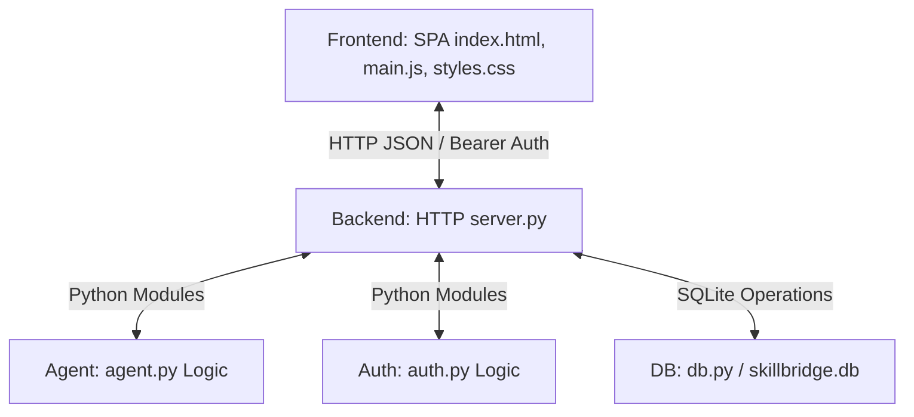

# SkillBridge Agent - Complete Developer Handbook & Reference

Welcome to the **SkillBridge Agent** developer handbook. This guide provides a detailed breakdown of the codebase architecture, database models, backend API endpoints, AI scoring logic, frontend state management, and custom CSS styling system. It is designed to give you complete visibility into the project so that you can confidently design, style, and extend the frontend user interface.

---

## Table of Contents
1. [System Architecture Overview](#system-architecture-overview)
2. [Database Schema & Models](#database-schema--models)
3. [Backend API Reference](#backend-api-reference)
4. [Agent Mechanics & Recommendation Logic](#agent-mechanics--recommendation-logic)
5. [Frontend Client Reference](#frontend-client-reference)
6. [Styling & Layout System](#styling--layout-system)
7. [Local Setup, Development, & Validation](#local-setup-development--validation)
8. [Security & Deployment Rules](#security--deployment-rules)

---

## System Architecture Overview

SkillBridge Agent is a dependency-light, single-page application (SPA) workspace tailored for workforce counselors. It is structured into three main layers:



- **Frontend Client**: A lightweight, highly performant SPA built in vanilla JavaScript ([src/main.js](file:///c:/Users/Mrigesh%20koyande/OneDrive/Desktop/Agent%20Infosys/Agent-Infosys/src/main.js)) and customized with CSS ([src/styles.css](file:///c:/Users/Mrigesh%20koyande/OneDrive/Desktop/Agent%20Infosys/Agent-Infosys/src/styles.css)).
- **Backend API**: Driven by a multi-threaded Python server ([backend/server.py](file:///c:/Users/Mrigesh%20koyande/OneDrive/Desktop/Agent%20Infosys/Agent-Infosys/backend/server.py)) using only standard libraries (`http.server.ThreadingHTTPServer`), making it extremely portable and dependency-free.
- **Database Layer**: SQLite ([backend/db.py](file:///c:/Users/Mrigesh%20koyande/OneDrive/Desktop/Agent%20Infosys/Agent-Infosys/backend/db.py)), maintaining users, active sessions, and analyzed cases.

---

## Database Schema & Models

The database resides locally by default at `data/skillbridge.db` (override via the `SKILLBRIDGE_DB` environment variable). The tables are structured as follows:

### 1. `users` Table
Stores authenticated workforce counselors.
```sql
CREATE TABLE IF NOT EXISTS users (
    id INTEGER PRIMARY KEY AUTOINCREMENT,
    name TEXT NOT NULL,
    email TEXT NOT NULL UNIQUE,
    password_hash TEXT NOT NULL,
    role TEXT NOT NULL DEFAULT 'counselor',
    created_at TEXT NOT NULL
);
```

### 2. `sessions` Table
Handles counselor session tokens with sliding expiration.
```sql
CREATE TABLE IF NOT EXISTS sessions (
    token TEXT PRIMARY KEY,
    user_id INTEGER NOT NULL,
    created_at TEXT NOT NULL,
    expires_at TEXT NOT NULL,
    FOREIGN KEY (user_id) REFERENCES users(id)
);
```

### 3. `cases` Table
Stores counselor intake records and corresponding agent analyses.
```sql
CREATE TABLE IF NOT EXISTS cases (
    id INTEGER PRIMARY KEY AUTOINCREMENT,
    user_id INTEGER NOT NULL,
    worker_name TEXT NOT NULL,
    notes TEXT NOT NULL,
    urgency TEXT NOT NULL,
    selected TEXT NOT NULL,      -- JSON-serialized list of industry signal tags (e.g., ["retail", "food"])
    analysis TEXT NOT NULL,      -- JSON-serialized complete evaluation response from the agent
    created_at TEXT NOT NULL,
    FOREIGN KEY (user_id) REFERENCES users(id)
);
```

---

## Backend API Reference

All requests and responses use JSON. Secure endpoints require authorization via HTTP headers using `Bearer` tokens:
```http
Authorization: Bearer <session_token>
```

### 1. Authentication Endpoints

#### `POST /api/auth/login`
Logs in a counselor manually.
- **Request Payload**:
  ```json
  {
    "email": "demo@skillbridge.local",
    "password": "demo-pass"
  }
  ```
- **Success Response (200 OK)**:
  ```json
  {
    "token": "QkdfeXQyN... (url-safe random token)",
    "user": {
      "id": 1,
      "name": "Demo Counselor",
      "email": "demo@skillbridge.local",
      "role": "demo"
    }
  }
  ```
- **Error Response (401 Unauthorized)**:
  ```json
  { "error": "Invalid email or password" }
  ```

#### `POST /api/auth/demo`
Enables one-click bypass login (commonly used for demonstration/testing).
- **Request Payload**: `{}` (Empty JSON object)
- **Success Response (200 OK)**:
  ```json
  {
    "token": "c19zcmR5W...",
    "user": {
      "id": 1,
      "name": "Demo Counselor",
      "email": "demo@skillbridge.local",
      "role": "demo"
    }
  }
  ```

---

### 2. Counselor Session Endpoints

#### `GET /api/me`
Retrieves details of the currently authenticated counselor.
- **Headers**: Required `Authorization: Bearer <token>`
- **Success Response (200 OK)**:
  ```json
  {
    "user": {
      "id": 1,
      "name": "Demo Counselor",
      "email": "demo@skillbridge.local",
      "role": "demo"
    }
  }
  ```
- **Error Response (401 Unauthorized)**:
  ```json
  { "user": null }
  ```

---

### 3. Case & Analysis Endpoints

#### `GET /api/cases`
Lists the last 20 cases processed by the logged-in counselor, sorted newest first.
- **Headers**: Required `Authorization: Bearer <token>`
- **Success Response (200 OK)**:
  ```json
  {
    "cases": [
      {
        "id": 2,
        "worker_name": "Jordan Rivera",
        "notes": "Store closing in 30 days. Strong shift lead history.",
        "urgency": "at-risk",
        "selected": ["retail", "food"],
        "analysis": {
          "skills": ["Customer support", "Inventory", "Cash handling", "Conflict resolution", "Scheduling", "Food safety", "Prep workflow", "Sanitation", "Supplier receiving", "Rush-hour coordination"],
          "pathways": [ ... ],
          "summary": { "skill_count": 10, "top_fit": 98, "urgency_label": "Medium" },
          "audit": [ ... ]
        },
        "created_at": "2026-06-14T08:00:00Z"
      }
    ]
  }
  ```

#### `POST /api/analyze`
Extracts transferable skills, ranks career pathways, performs audit quality checks, and saves the result in the SQLite database as a new case record.
- **Headers**: Required `Authorization: Bearer <token>`
- **Request Payload**:
  ```json
  {
    "workerName": "Maya Patel",
    "notes": "Laid off after plant closure. Can work evenings, has reliable bus access.",
    "urgency": "lost-job",
    "selected": ["manufacturing", "logistics"]
  }
  ```
- **Success Response (200 OK)**:
  ```json
  {
    "caseId": 3,
    "analysis": {
      "notes": "Laid off after plant closure. Can work evenings, has reliable bus access.",
      "selected": ["manufacturing", "logistics"],
      "urgency": "lost-job",
      "skills": [
        "Machine operation",
        "Quality control",
        "Maintenance",
        "Forklift",
        "Lean safety",
        "Route planning",
        "Warehouse systems",
        "Loading",
        "Dispatch",
        "OSHA awareness"
      ],
      "pathways": [
        {
          "title": "Industrial Maintenance Technician",
          "wage": "$27-38/hr",
          "training": "8 week paid apprenticeship",
          "tags": ["manufacturing", "logistics"],
          "barrier": "Paid path, safety credential",
          "why": "Converts hands-on troubleshooting into a credential employers can verify quickly.",
          "score": 98,
          "next_steps": [
            "Validate experience with one supervisor or reference",
            "Enroll in 8 week paid apprenticeship",
            "Generate a resume bullet set from the extracted skills"
          ]
        },
        {
          "title": "Supply Chain Coordinator",
          "wage": "$24-34/hr",
          "training": "6 week hybrid certificate",
          "tags": ["logistics", "retail", "food"],
          "barrier": "Hybrid schedule",
          "why": "Matches inventory, dispatch, vendor, and scheduling skills to resilient operations roles.",
          "score": 85,
          "next_steps": [ ... ]
        }
      ],
      "summary": {
        "skill_count": 10,
        "top_fit": 98,
        "urgency_label": "High"
      },
      "audit": [
        "Skill extraction completed",
        "Pathway ranking completed",
        "Barrier and next-step checks completed"
      ]
    }
  }
  ```

#### `GET /api/health`
Basic health status endpoint.
- **Success Response (200 OK)**:
  ```json
  {
    "ok": true,
    "service": "skillbridge"
  }
  ```

---

## Agent Mechanics & Recommendation Logic

The AI matching core is written in Python ([backend/agent.py](file:///c:/Users/Mrigesh%20koyande/OneDrive/Desktop/Agent%20Infosys/Agent-Infosys/backend/agent.py)). Knowing this business logic allows you to design intuitive UI dashboards that visualize these exact mappings.

### 1. Industry Signals & Skill Mappings (`ROLE_SIGNALS`)
The agent extracts specific skills based on the sector checkbox selections (`selected` array):

| Sector Key | UI Label | Details | Extracted Skills |
| :--- | :--- | :--- | :--- |
| **`manufacturing`** | Manufacturing | Plant, tools, QA | Machine operation, Quality control, Maintenance, Forklift, Lean safety |
| **`retail`** | Retail | Customers, stock, POS | Customer support, Inventory, Cash handling, Conflict resolution, Scheduling |
| **`caregiving`** | Caregiving | Care, records, safety | Patient care, Documentation, Empathy, Medication reminders, Home safety |
| **`food`** | Food service | Prep, rush, hygiene | Food safety, Prep workflow, Sanitation, Supplier receiving, Rush-hour coordination |
| **`logistics`** | Logistics | Routes, loading, dispatch | Route planning, Warehouse systems, Loading, Dispatch, OSHA awareness |

---

### 2. Available Target Pathways (`PATHWAYS`)
The target career options modeled inside the agent:

*   **Industrial Maintenance Technician**
    - Wage: `$27-38/hr`
    - Training: `8 week paid apprenticeship`
    - Tags: `["manufacturing", "logistics"]`
    - Barrier: `Paid path, safety credential`
    - Why: *"Converts hands-on troubleshooting into a credential employers can verify quickly."*
*   **Supply Chain Coordinator**
    - Wage: `$24-34/hr`
    - Training: `6 week hybrid certificate`
    - Tags: `["logistics", "retail", "food"]`
    - Barrier: `Hybrid schedule`
    - Why: *"Matches inventory, dispatch, vendor, and scheduling skills to resilient operations roles."*
*   **Certified Medical Assistant**
    - Wage: `$21-29/hr`
    - Training: `10 week evening bridge`
    - Tags: `["caregiving", "retail"]`
    - Barrier: `Evening classes, bus access`
    - Why: *"Strong fit for service, documentation, and calm-under-pressure experience."*
*   **Food Safety Supervisor**
    - Wage: `$23-31/hr`
    - Training: `4 week ServSafe + leadership sprint`
    - Tags: `["food", "retail"]`
    - Barrier: `Short credential`
    - Why: *"Turns frontline food experience into management-ready compliance evidence."*

---

### 3. Scoring Formula
The recommendation score evaluates how well the worker's experience matches the pathways.

#### Step A: Calculate Tag Overlap
Find the number of sector tags shared between a pathway and the counselor's selections:
$$\text{Overlap} = \text{Count of } (\text{Pathway Tags} \cap \text{Counselor Selected Tags})$$

#### Step B: Urgency Boost Calculation
The urgency code contributes a situational adjustment value:
$$\text{lost-job} = 12 \quad\Big|\quad \text{at-risk} = 8 \quad\Big|\quad \text{career-change} = 4 \quad\Big|\quad \text{default} = 4$$

#### Step C: Final Score Formula
The score starts with a baseline of $58$, adds $15$ points per overlapping sector tag, adds the urgency boost, and locks to a maximum of $98$:
$$\text{Pathway Score} = \min\left(98, \; 58 + (\text{Overlap} \times 15) + \text{Urgency Boost}\right)$$

*Example*: Selecting `["manufacturing", "logistics"]` (2 tags overlap with *Industrial Maintenance Technician*) under a `lost-job` urgency ($+12$ boost) outputs:
$$\text{Score} = \min(98, \; 58 + (2 \times 15) + 12) = \min(98, \; 100) = 98$$

---

## Frontend Client Reference

The client application is built with a single-state controller layout inside [src/main.js](file:///c:/Users/Mrigesh%20koyande/OneDrive/Desktop/Agent%20Infosys/Agent-Infosys/src/main.js).

### Global State Store (`state`)
```javascript
const state = {
  token: localStorage.getItem('skillbridge_token'), // Bearer session token
  user: JSON.parse(localStorage.getItem('skillbridge_user') || 'null'), // Current user metadata
  workerName: 'Maya Patel', // Input text
  selected: ['manufacturing', 'logistics'], // Selected sector signal keys
  urgency: 'lost-job', // Urgency dropdown key
  notes: 'Laid off...', // Intake textarea context
  analysis: null, // Holds the result object from /api/analyze
  cases: [], // Cached historical cases array
  loading: false, // UI loading spinner toggle
  error: '', // Error notice string
};
```

### Component Rendering Flow
All state alterations invoke a view update to redetermine the layout:

```mermaid
graph TD
    StateChange[State Modifying Event] -->|Calls API or updates local values| StateUpdate[Update state properties]
    StateUpdate -->|Checks state.token| AuthChoice{Has active token?}
    AuthChoice -->|Yes| RenderApp[renderApp()]
    AuthChoice -->|No| RenderAuth[renderAuth()]
    RenderApp --> BindListeners[Bind workspace event listeners]
    RenderAuth --> BindAuthListeners[Bind login/demo event listeners]
```

- **`renderAuth()`**: Generates the authentication screen. Includes a manual login form (listening to `submit`) and a bypass demo button (listening to `click`).
- **`renderApp()`**: Generates the counselor dashboard. Binds DOM event listeners:
  - Input field listeners updating `state.workerName`, `state.notes`, and `state.urgency`.
  - Sector button clicks updating `state.selected` array elements and triggering recursive rendering.
  - "Load sample" button populated with mock worker state.
  - "Run Agent" button triggering `runAnalysis()`.
  - "Sign out" button invoking session termination.

---

## Styling & Layout System

Styling is localized inside [src/styles.css](file:///c:/Users/Mrigesh%20koyande/OneDrive/Desktop/Agent%20Infosys/Agent-Infosys/src/styles.css) using a robust modern CSS variables theme.

### 1. Color Tokens (`:root`)
```css
:root {
  color: #17202a;
  background: #edf1f5;
  font-family: Inter, ui-sans-serif, system-ui, -apple-system, BlinkMacSystemFont, "Segoe UI", sans-serif;
  --ink: #17202a;         /* Main body color */
  --muted: #647386;       /* Subtext and captions */
  --line: #d8e0e8;        /* Border dividers */
  --panel: rgba(255, 255, 255, 0.94); /* Card backdrops */
  --green: #176b55;       /* Focus and primary actions */
  --blue: #155f8f;        /* Informational and links */
  --amber: #a86412;       /* Manufacturing styling accent */
  --rose: #a34358;        /* Caregiving styling accent */
  --violet: #6952a3;      /* Logistics styling accent */
}
```

### 2. Main Layout Grids
- **`.auth-shell`**: Uses a two-column desktop grid: `grid-template-columns: minmax(0, 1fr) 440px`.
- **`.app-shell`**: Main dashboard grid separating the sidebar and the workbench content area: `grid-template-columns: 282px minmax(0, 1fr)`.
- **`.workspace-grid`**: Arranges the input intake form side-by-side with the output analysis panel: `grid-template-columns: minmax(340px, 0.86fr) minmax(0, 1.14fr)`.
- **`.lower-grid`**: Places quality checks and case history next to each other: `grid-template-columns: 0.8fr 1.2fr`.

### 3. Responsive Breakpoints
The interface dynamically morphs into a stacked structure at specific width thresholds:
- **`@media (max-width: 1100px)`**: Converts grids (`.app-shell`, `.workspace-grid`, `.lower-grid`) to single-column blocks. The sidebar unpins and sits inline.
- **`@media (max-width: 760px)`**: Fits viewport for tablets/mobile screens. Scales down headings and transforms the grid layouts for metrics, signals, and pathway cards to 100% width.

---

## Local Setup, Development, & Validation

To build and run the application locally:

### 1. Installation & Start
Install requirements and launch the local HTTP server:
```bash
npm install
npm run build
npm start
```
By default, the server listens at **`http://localhost:5173`**.

---

### 2. Integrity Verification
The project uses a custom automation validator ([scripts/validate.mjs](file:///c:/Users/Mrigesh%20koyande/OneDrive/Desktop/Agent%20Infosys/Agent-Infosys/scripts/validate.mjs)) executing compilation checks and asset integrity constraints. Run this whenever you modify files:
```bash
npm run build
```

The validation suite executes the following:
1. Verifies existence and content checks for critical codebase components (e.g., `index.html`, `src/main.js`, `src/styles.css`, python scripts).
2. Verifies that `index.html` loads `src/main.js` and contains correct metadata tags.
3. Performs substring token sanity checks on `src/main.js` (requires `demoLogin`, `manualLogin`, `runAnalysis`, `/api/analyze`).
4. Performs substring token sanity checks on `backend/server.py` (requires routing paths and server config).
5. Compiles Python backend files (`python -m compileall -q backend`) to prevent syntax regressions.

---

## Security & Deployment Rules

1. **Credentials Management**:
   Do **NOT** commit `.env` configuration files, SQLite binary databases, active passwords, API tokens, or service credentials to version control. The [.gitignore](file:///c:/Users/Mrigesh%20koyande/OneDrive/Desktop/Agent%20Infosys/Agent-Infosys/.gitignore) file handles exclusion.
2. **Minimal Dependency Principle**:
   Keep the project dependencies as thin as possible. Avoid adding unnecessary packages (like heavy React components or CSS frameworks) unless strictly requested. The codebase is designed to run efficiently out of the box using vanilla code and Python's standard libraries.
3. **Workspace Focus**:
   When refactoring the frontend, focus on usability improvements to enhance counselor productivity (dashboard readability, audit accessibility, responsive handling) rather than generic static product marketing copy.

